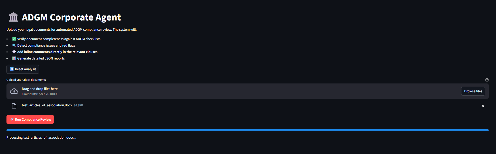
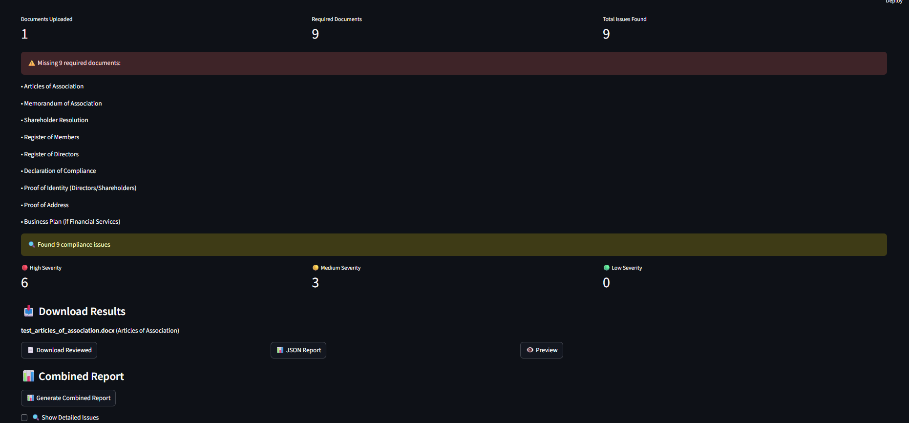

# 🏛️ ADGM Corporate Agent – AI-Powered Legal Document Compliance Reviewer

[](https://python.org)
[](https://openai.com)
[](https://pinecone.io)
[](https://streamlit.io)
[](LICENSE)
[](https://shivam909058-ai-engineer-task-shivam909058-main-app-p6ampt.streamlit.app/)

> **An intelligent legal document reviewer specifically designed for Abu Dhabi Global Market (ADGM) compliance.**

## 🌐 **Live Demo**

### 🚀 **[Try the ADGM Corporate Agent Live](https://shivam909058-ai-engineer-task-shivam909058-main-app-p6ampt.streamlit.app/)**

**✨ Experience the full system in action:**
- Upload your DOCX legal documents
- Get instant ADGM compliance analysis
- Download professionally annotated documents
- Generate comprehensive JSON reports

> **Note**: You'll need your own OpenAI and Pinecone API keys to use the live demo. See [Setup Instructions](#-quick-start) below.

---

Transform your legal document review process with AI-powered compliance checking that identifies issues, suggests corrections, and ensures ADGM regulatory adherence.

## 🎯 Overview

The ADGM Corporate Agent is a sophisticated **Retrieval-Augmented Generation (RAG)** system that:

- 📋 **Analyzes** legal documents against official ADGM templates and regulations
- 🔍 **Detects** compliance issues with specific citations and severity levels  
- 💬 **Annotates** documents with inline comments directly in problematic clauses
- 📊 **Generates** comprehensive JSON reports with actionable recommendations
- ✅ **Verifies** document completeness against ADGM checklists
- 🎨 **Creates** lawyer-grade reviewed documents with professional summary pages

## ✨ Key Features

### 🧠 Intelligent Compliance Analysis
- **Smart Document Classification**: Automatically identifies document types (Articles of Association, Memorandum, Employment Contracts, etc.)
- **Contextual Issue Detection**: Uses ADGM knowledge base to find jurisdiction errors, missing clauses, and regulatory violations
- **Severity Assessment**: Categorizes issues as High, Medium, or Low priority with specific citations

### 📝 Professional Document Annotation
- **Inline Comments**: Places corrections directly next to problematic text
- **Visual Summary Page**: Comprehensive executive summary with compliance status
- **Missing Documents Report**: Identifies gaps in required documentation
- **Color-Coded Issues**: Red for critical, orange for important, yellow for minor issues

### 📊 Comprehensive Reporting
- **JSON Compliance Reports**: Machine-readable structured data for integration
- **Executive Summaries**: High-level overview for stakeholders
- **Action Items**: Clear guidance on required corrections
- **ADGM Citations**: Specific regulatory references for each issue

### 🔧 Advanced Technology Stack
- **RAG Architecture**: Combines retrieval and generation for accurate, contextual responses
- **Vector Search**: Pinecone-powered semantic search through ADGM knowledge base
- **State Management**: Persistent results across user sessions
- **Concurrent Processing**: Optimized performance for multiple documents

## 🖼️ Screenshots

### Main Interface

*Clean, intuitive interface for document upload and processing*

### Compliance Analysis Results  

*Detailed results with issue categorization and severity indicators*

### Document Preview & Downloads

*Preview functionality and download options for reviewed documents*

### Demo Video
[📹 Watch Demo Video](Demo_video/Demo_video.mp4)
*Watch the ADGM Corporate Agent in action - complete document analysis workflow*


## 🚀 Quick Start

### Prerequisites
- Python 3.10 or higher
- OpenAI API key
- Pinecone account and API key
- ADGM knowledge base documents (PDFs/DOCX)

### 1. Installation

```bash
# Clone the repository
git clone https://github.com/yourusername/adgm-corporate-agent.git
cd adgm-corporate-agent

# Create virtual environment (recommended)
python -m venv venv
source venv/bin/activate  # On Windows: venv\Scripts\activate

# Install dependencies
pip install -r requirements.txt
```

### 2. Environment Setup

Create a `.env` file in the root directory:

```env
OPENAI_API_KEY=your_openai_api_key_here
PINECONE_API_KEY=your_pinecone_api_key_here
```

### 3. Knowledge Base Preparation

Organize your ADGM documents in the `KB/` folder:

```
KB/
├── ADGM Standard Employment Contract Template - ER 2024.docx
├── adgm-ra-model-articles-private-company-limited-by-shares.docx
├── Private Company Limited by Shares - Non-Financial Services.pdf
├── Checklist Company Set Up V1 20220530 Investment Company LTD.pdf
├── Schedule of Fees 2025.pdf
└── ... (other official ADGM documents)
```

### 4. Index the Knowledge Base

Run the preprocessing script to build the vector database:

```bash
python preprocess_index.py
```

This process will:
- Extract text from all PDF and DOCX files in the KB folder
- Clean and chunk the content into searchable segments
- Generate embeddings using OpenAI's text-embedding-3-large model
- Store embeddings in Pinecone with metadata (document type, process type, source)
- Create a local metadata backup file

### 5. Launch the Application

```bash
streamlit run main_app.py
```

Open your browser to `http://localhost:8501` and start reviewing documents!

## 📱 Usage Guide

### Step 1: Upload Documents
- Click "Upload your .docx documents"
- Select one or multiple DOCX files
- Supported document types: Articles of Association, Memorandums, Employment Contracts, Resolutions, etc.

### Step 2: Run Compliance Review
- Click "🚀 Run Compliance Review"
- The system will:
  - Classify each document type
  - Analyze against ADGM requirements  
  - Detect compliance issues
  - Generate inline comments
  - Create summary reports

### Step 3: Review Results
- **Summary Metrics**: See total issues found by severity
- **Missing Documents**: Identify gaps in required documentation
- **Issue Breakdown**: High/Medium/Low severity categorization

### Step 4: Download Outputs
- **📄 Reviewed Documents**: DOCX files with inline comments and summary pages
- **📊 JSON Reports**: Structured data for each document
- **💾 Combined Report**: Comprehensive analysis of all uploaded documents

### Step 5: Document Preview
- Click "👁️ Preview" to see processed documents
- Review inline comments and corrections
- Verify all issues have been properly marked

## 🔧 Technical Architecture

### RAG Pipeline
```
User Document → Text Extraction → Document Classification → 
Section Analysis → Vector Search (Pinecone) → 
Compliance Analysis (GPT-4) → Issue Detection → 
Comment Insertion → Report Generation
```

### Core Components

#### 1. Document Processing Engine
- **Text Extraction**: Robust handling of DOCX and PDF formats
- **Smart Chunking**: Context-aware text segmentation
- **Metadata Enrichment**: Document type and process classification

#### 2. Knowledge Base System
- **Vector Database**: Pinecone-powered semantic search
- **Content Management**: Automatic indexing of ADGM documents
- **Contextual Retrieval**: Relevant regulation matching

#### 3. Compliance Analysis Engine
- **Issue Detection**: AI-powered identification of regulatory violations
- **Severity Assessment**: Risk-based prioritization
- **Citation Mapping**: Specific ADGM regulation references

#### 4. Document Generation
- **Inline Annotation**: Direct clause-level commenting
- **Professional Formatting**: Lawyer-grade document styling
- **Summary Creation**: Executive-level compliance overview

## 📋 Sample Output

### JSON Compliance Report
```json
{
  "document": "test_articles_of_association.docx",
  "document_type": "Articles of Association", 
  "issues_count": 9,
  "issues": [
    {
      "section": "laws of the UAE Federal Courts",
      "issue": "Wrong jurisdiction for governing law",
      "severity": "High",
      "suggestion": "Should be governed by ADGM laws",
      "citation": "ADGM Commercial Licensing Regulations 2015",
      "section_index": 0,
      "document": "test_articles_of_association.docx"
    },
    {
      "section": "The Company shall have at least one director",
      "issue": "Minimum number of directors not compliant", 
      "severity": "High",
      "suggestion": "Increase minimum to two directors per ADGM requirements",
      "citation": "Companies Regulations 2020, section 137(1)",
      "section_index": 1,
      "document": "test_articles_of_association.docx"
    }
  ]
}
```

### Document Summary Page
The reviewed documents include a comprehensive summary page with:

- **🎯 Executive Summary**: Compliance status and risk assessment
- **📊 Issues Breakdown**: Count by severity with visual indicators
- **📋 Missing Documents**: Required documents not yet provided
- **📖 Review Guide**: Instructions for reading inline comments
- **⚠️ Action Items**: Priority corrections needed

## 🧪 Testing

### Sample Test Documents

Use the provided test files to validate functionality:

**`test_articles_of_association.docx`** - Contains intentional compliance issues:
- Wrong jurisdiction references (UAE Federal vs ADGM Courts)
- Missing required clauses
- Insufficient director requirements
- Incomplete signature blocks

Expected results: 7-9 issues detected across High, Medium, and Low severity levels.

### Testing Checklist
- [ ] Document upload and processing
- [ ] Issue detection and classification  
- [ ] Inline comment insertion
- [ ] JSON report generation
- [ ] Missing documents identification
- [ ] Preview functionality
- [ ] Combined report creation

## 🔧 Configuration

### Model Settings
```python
# Core AI Models
EMBED_MODEL = "text-embedding-3-large"  # OpenAI embedding model
LLM_MODEL = "gpt-4-turbo-preview"       # GPT model for analysis

# Performance Settings  
TOP_K_RETRIEVAL = 5                     # Number of context chunks retrieved
CHUNK_SIZE = 800                        # Text chunk size for processing
CHUNK_OVERLAP = 100                     # Overlap between chunks
```

### ADGM Checklists
The system includes built-in checklists for common ADGM processes:

- **Company Incorporation**: 9 required documents
- **Employment Documentation**: 4 required documents
- Easily extensible for additional processes

## 🔍 Supported Document Types

### Input Formats
- ✅ **DOCX**: Microsoft Word documents (primary format)
- ✅ **PDF**: Converted to text for knowledge base (KB only)

### Document Categories
- **Articles of Association**
- **Memorandum of Association** 
- **Shareholder Resolutions**
- **Employment Contracts**
- **Register of Members/Directors**
- **Declaration of Compliance**
- **Other ADGM regulatory documents**

## 🛡️ Compliance Coverage

### Issue Detection
- **Jurisdiction Errors**: Wrong court/law references
- **Missing Clauses**: Required ADGM provisions
- **Director Requirements**: Minimum numbers and qualifications
- **Share Capital**: Proper structuring and issuance
- **Meeting Procedures**: Quorum and notice requirements
- **Accounting Standards**: ADGM-specific requirements
- **Liquidation Procedures**: Proper ADGM processes

### Severity Levels
- 🔴 **High**: Critical issues preventing approval/registration
- 🟡 **Medium**: Important issues requiring attention
- 🟢 **Low**: Minor improvements and recommendations

## 🚦 Performance & Limitations

### Performance
- **Processing Speed**: ~30-60 seconds per document
- **Concurrent Analysis**: Multiple documents processed in parallel
- **Memory Usage**: Optimized chunking for large documents
- **API Efficiency**: Batched requests to reduce latency

### Current Limitations
- **Input Format**: DOCX only (PDFs must be converted)
- **Language**: English documents only
- **Scope**: ADGM-specific compliance (not other jurisdictions)
- **Legal Advice**: Tool assists but doesn't replace professional legal review

### Planned Enhancements
- [ ] PDF input support
- [ ] Multi-language support
- [ ] Additional jurisdiction support
- [ ] Advanced workflow management
- [ ] Integration APIs

## 🤝 Contributing

We welcome contributions! Please see our [Contributing Guide](CONTRIBUTING.md) for details.

### Development Setup
```bash
# Install development dependencies
pip install -r requirements-dev.txt

# Run tests
pytest tests/

# Code formatting
black main_app.py
flake8 main_app.py
```

## 📄 License

This project is licensed under the MIT License - see the [LICENSE](LICENSE) file for details.

## 🆘 Support

### Common Issues

**"No module named 'frontend'"**
```bash
# Uninstall conflicting packages
pip uninstall -y frontend fitz PyMuPDF
pip install --no-cache-dir PyMuPDF==1.24.10
```

**"JSON decode error"**
- Check your OpenAI API key and quota
- Verify document format is valid DOCX
- Try with a smaller document first

**"Pinecone connection error"**
- Verify your Pinecone API key
- Check index name matches configuration
- Ensure Pinecone plan supports your usage

### Getting Help
- 📧 Email: support@yourcompany.com
- 💬 Issues: [GitHub Issues](https://github.com/yourusername/adgm-corporate-agent/issues)
- 📖 Documentation: [Wiki](https://github.com/yourusername/adgm-corporate-agent/wiki)

## 🙏 Acknowledgments

- **ADGM**: For providing comprehensive regulatory documentation
- **OpenAI**: For GPT-4 and embedding models
- **Pinecone**: For vector database infrastructure
- **Streamlit**: For rapid web application development

---

**⚠️ Disclaimer**: This tool is designed to assist with ADGM compliance review but does not constitute legal advice. Always consult with qualified legal professionals for official document review and regulatory compliance.

---

*Built with ❤️ for the ADGM legal community*
